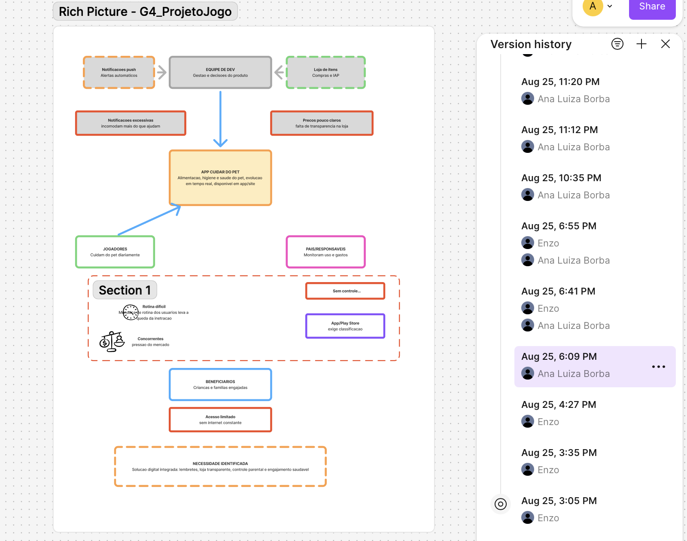
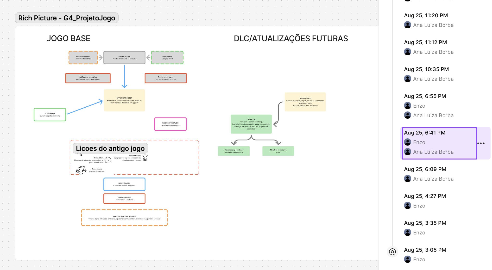
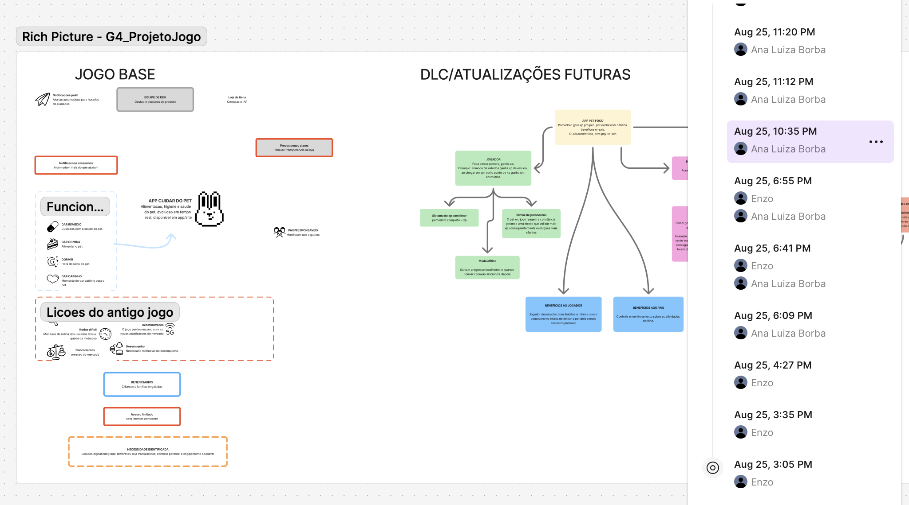
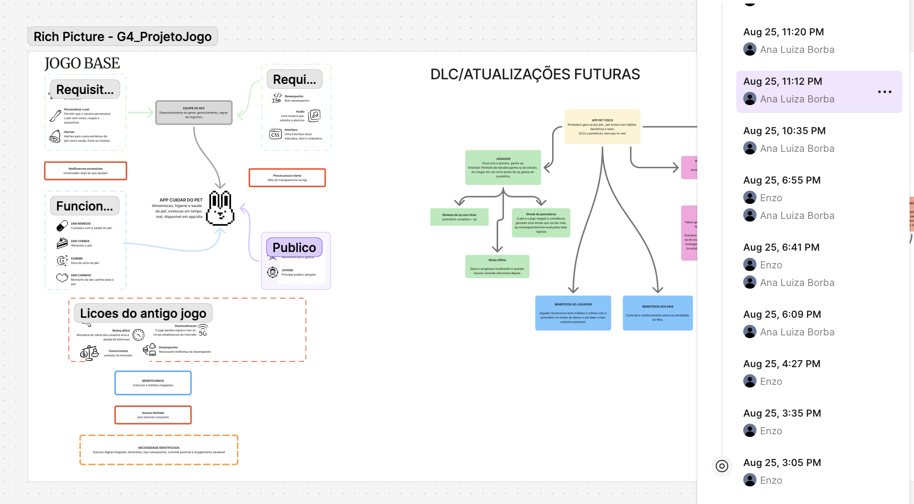
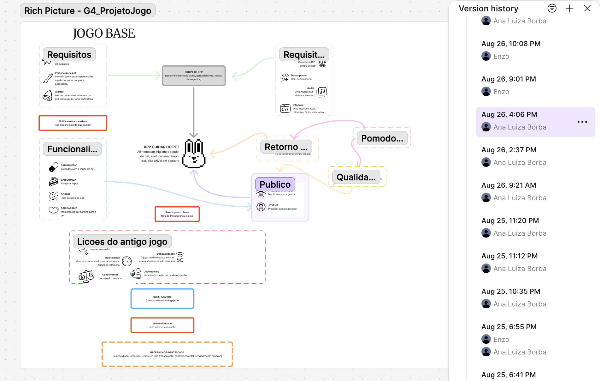
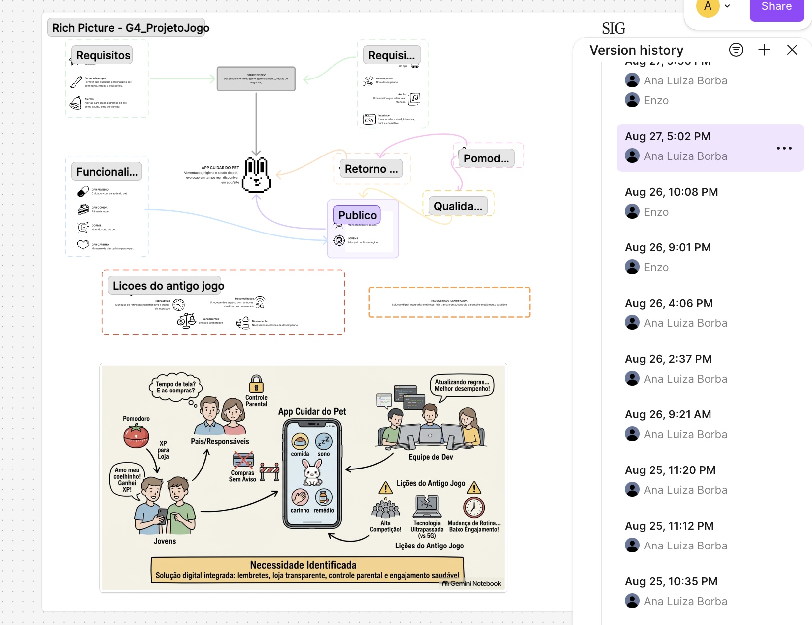
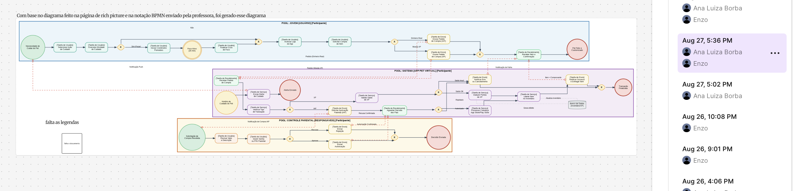
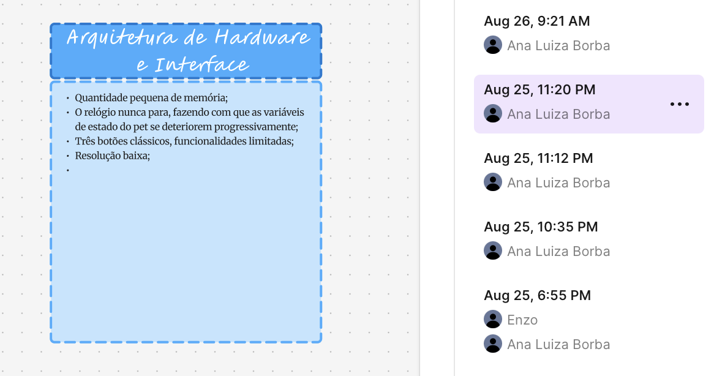
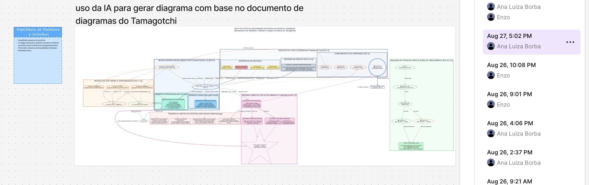
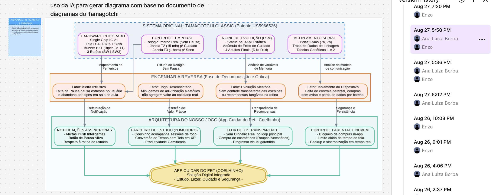

# SubEquipe_02

Esta página reúne as evidências de elaboração dos artefatos desenvolvidos
pela SubEquipe_02. As evidências incluem registros visuais do processo de
construção, links para materiais produzidos e registros relacionados ao uso
de IA Generativa.

## Evidências

### Vínculos no relatório

As evidências desta página estão relacionadas aos seguintes tópicos do relatório:

- [Rich Picture](../Relatórios/1.1.2.SubEquipe_02.md#foco_01-artefatos-generalistas--nfr-framework)
- [SIG](../Relatórios/1.1.2.SubEquipe_02.md#foco_01-artefatos-generalistas--nfr-framework)
- [Modelagem BPMN](../Relatórios/1.1.2.SubEquipe_02.md#foco_02-engenharia-reversa--modelagem-bpmn)
- [Engenharia Reversa](../Relatórios/1.1.2.SubEquipe_02.md#foco_02-engenharia-reversa--modelagem-bpmn)
- [IA Generativa](../Relatórios/1.1.2.SubEquipe_02.md#foco_03-ia-generativa)

---

## Desenho do Rich Picture

### Evidências de elaboração

Registro do processo de construção e refinamento do Rich Picture,
incluindo a organização dos elementos e representação das principais
interações identificadas no sistema.

### Materiais relacionados

- [Link para o Rich Picture](../Relatórios/1.1.2.SubEquipe_02.md#foco_01-artefatos-generalistas--nfr-framework)

---

## Construção do SIG

### Evidências de elaboração

Registros do processo de construção do SIG, demonstrando a organização
dos elementos e a evolução do artefato durante sua elaboração.

### Materiais relacionados

- [Link para o SIG](../Relatórios/1.1.2.SubEquipe_02.md#decomposição-e-análise-dos-softgoals-no-sig)

---

## Modelagem BPMN

### Evidências de elaboração

Registros do processo de modelagem BPMN, incluindo a construção,
organização, revisão e refinamento dos fluxos representados.

[Evidência 02 — Prompt para geração do BPMN](https://notebook.google.com/notebook/9e5bf25a-5096-48dc-ad75-531c63114d2e/)

### Materiais relacionados

- [Link para o modelo BPMN](../Relatórios/1.1.2.SubEquipe_02.md#foco_02-engenharia-reversa--modelagem-bpmn)

---

## Engenharia Reversa

### Evidências de elaboração

Registros utilizados durante o processo de Engenharia Reversa, incluindo
a análise do sistema de referência, levantamento de comportamentos,
identificação de funcionalidades e documentação das informações obtidas.

[Evidência 01 — Análise para Engenharia Reversa](https://notebook.google.com/notebook/64404cd3-9f91-4579-ac4b-74c510d20faf/)

### Materiais relacionados

- [Link para o modelo Engenharia Reversa](../Relatórios/1.1.2.SubEquipe_02.md#foco_02-engenharia-reversa--modelagem-bpmn)

---

## IA Generativa

### Evidências de utilização

Esta seção apresenta os registros relacionados à utilização de ferramentas
de IA Generativa durante o desenvolvimento dos artefatos, incluindo
prompts, respostas obtidas, análises e utilização das informações como
apoio ao processo de elaboração.

[Evidência 01 — Prompt utilizado](https://notebook.google.com/notebook/64404cd3-9f91-4579-ac4b-74c510d20faf/)

[Evidência 02 — Prompt utilizado](https://notebook.google.com/notebook/9e5bf25a-5096-48dc-ad75-531c63114d2e/)

### Materiais relacionados

- [Link para os registros da IA Generativa](INSERIR_LINK)
- [Link para material complementar](INSERIR_LINK)

---

## Evidências em vídeo

| Artefato | Descrição | Link |
|---|---|---|
| Entrega final | Apresentação da ideia e do resultado final | [Acessar vídeo](https://www.youtube.com/watch?v=B9lzNZdJnf0) |

---

## Comprobatórios de commits

Os commits relacionados aos artefatos desenvolvidos pela SubEquipe_03
podem ser consultados diretamente na branch:

[Commits da branch](https://github.com/UnBArqDsw2026-2-Turma02/2026.2-T02-_G4_ProjetoJogo_Entrega_01/commits/docs/subequipe02/)