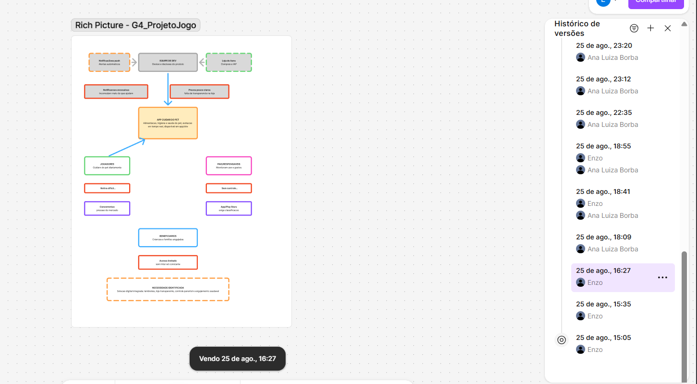
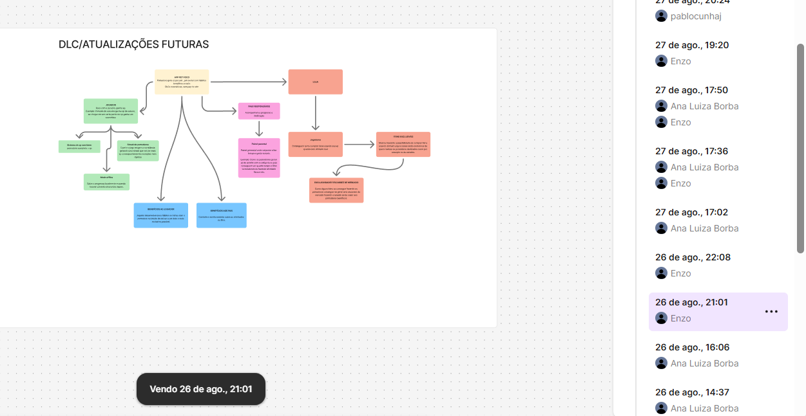
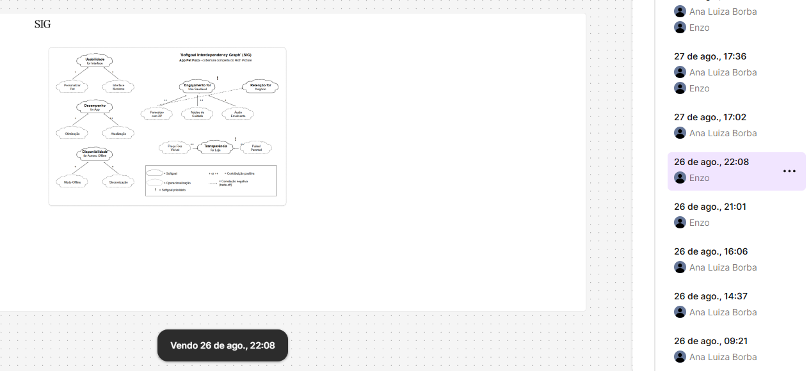

# SubEquipe_02

Esta página reúne as evidências de elaboração dos artefatos desenvolvidos
pela SubEquipe_02. As evidências incluem registros visuais do processo de
construção, links para materiais produzidos e registros relacionados ao uso
de IA Generativa.

## Evidências

### Vínculos no relatório

As evidências desta página estão relacionadas aos seguintes tópicos do relatório:

- [Rich Picture](../Relatórios/1.1.2.SubEquipe_02.md#foco_01-artefatos-generalistas--nfr-framework)
- [SIG](../Relatórios/1.1.2.SubEquipe_02.md#foco_01-artefatos-generalistas--nfr-framework)
- [Modelagem BPMN](../Relatórios/1.1.2.SubEquipe_02.md#foco_02-engenharia-reversa--modelagem-bpmn)
- [Engenharia Reversa](../Relatórios/1.1.2.SubEquipe_02.md#foco_02-engenharia-reversa--modelagem-bpmn)
- [IA Generativa](../Relatórios/1.1.2.SubEquipe_02.md#foco_03-ia-generativa)

---

## Desenho do Rich Picture

### Evidências de elaboração

Registro do processo de construção e refinamento do Rich Picture,
incluindo a organização dos elementos e representação das principais
interações identificadas no sistema.

### Materiais relacionados

- [Link para o Rich Picture](../Relatórios/1.1.2.SubEquipe_02.md#foco_01-artefatos-generalistas--nfr-framework)

---

## Construção do SIG

### Evidências de elaboração

Registros do processo de construção do SIG, demonstrando a organização
dos elementos e a evolução do artefato durante sua elaboração, com base
no histórico de versões do Figma (26/08).

[Evidência 02 — Prompt utilizado para elaboração do SIG](../../assets/SubEquipe_02/evidencias/prompt_sig.md)

### Materiais relacionados

- [Link para o SIG](../Relatórios/1.1.2.SubEquipe_02.md#decomposição-e-análise-dos-softgoals-no-sig)

---

## Modelagem BPMN

### Evidências de elaboração

Registros do processo de modelagem BPMN, incluindo a construção,
organização, revisão e refinamento dos fluxos representados.

[Evidência 02 — Prompt para geração do BPMN](https://notebook.google.com/notebook/9e5bf25a-5096-48dc-ad75-531c63114d2e/)

### Materiais relacionados

- [Link para o modelo BPMN](../Relatórios/1.1.2.SubEquipe_02.md#foco_02-engenharia-reversa--modelagem-bpmn)

---

## Engenharia Reversa

### Evidências de elaboração

Registros utilizados durante o processo de Engenharia Reversa, incluindo
a análise do sistema de referência, levantamento de comportamentos,
identificação de funcionalidades e documentação das informações obtidas.

[Evidência 01 — Análise para Engenharia Reversa](https://notebook.google.com/notebook/64404cd3-9f91-4579-ac4b-74c510d20faf/)

### Materiais relacionados

- [Link para o modelo Engenharia Reversa](../Relatórios/1.1.2.SubEquipe_02.md#foco_02-engenharia-reversa--modelagem-bpmn)

---

## IA Generativa

### Evidências de utilização

Esta seção apresenta os registros relacionados à utilização de ferramentas
de IA Generativa durante o desenvolvimento dos artefatos, incluindo
prompts, respostas obtidas, análises e utilização das informações como
apoio ao processo de elaboração.

[Evidência 01 — Prompt utilizado (Engenharia Reversa)](https://notebook.google.com/notebook/64404cd3-9f91-4579-ac4b-74c510d20faf/)

[Evidência 02 — Prompt utilizado (BPMN)](https://notebook.google.com/notebook/9e5bf25a-5096-48dc-ad75-531c63114d2e/)

[Evidência 03 — Prompt utilizado (SIG)](../../assets/SubEquipe_02/evidencias/prompt_sig.md)

---

## Evidências em vídeo

| Artefato | Descrição | Link |
|---|---|---|
| Entrega final | Apresentação da ideia e do resultado final | [Acessar vídeo](https://www.youtube.com/watch?v=B9lzNZdJnf0) |

---

## Comprobatórios de commits

Os commits relacionados aos artefatos desenvolvidos pela SubEquipe_02
podem ser consultados diretamente na branch:

[Commits da branch](https://github.com/UnBArqDsw2026-2-Turma02/2026.2-T02-_G4_ProjetoJogo_Entrega_01/commits/docs/subequipe02/)

### Linha do Tempo de Commits (extraída do histórico real do repositório)

| Data/Hora | Autor | Mensagem do Commit | Hash |
|---|---|---|---|
| 27/08/2026, 23:55 | Pablo Cunha de Jesus | docs: documentação e imagens referentes a subequipe2 | [`64667a4`](https://github.com/UnBArqDsw2026-2-Turma02/2026.2-T02-_G4_ProjetoJogo_Entrega_01/commit/64667a426ccd8e2e10c48c4981a2b4ec87e2ba34) |
| 28/08/2026, 00:04 | Pablo Cunha de Jesus | docs: limpeza e correção do template | [`68d26e3`](https://github.com/UnBArqDsw2026-2-Turma02/2026.2-T02-_G4_ProjetoJogo_Entrega_01/commit/68d26e37aa05d4fe353503c93f48358c6518566a) |
| 28/08/2026, 00:10 | Pablo Cunha de Jesus | docs: adição de contribuiçoes dos integrantes | [`7cd31f6`](https://github.com/UnBArqDsw2026-2-Turma02/2026.2-T02-_G4_ProjetoJogo_Entrega_01/commit/7cd31f62d4c295d6415cac7dec07127b5a5b3485) |
| 28/08/2026, 00:11 | Pablo Cunha de Jesus | docs: correção de Significancia de contribuição | [`774b273`](https://github.com/UnBArqDsw2026-2-Turma02/2026.2-T02-_G4_ProjetoJogo_Entrega_01/commit/774b273c40f192146f2b689b699d5dffde511531) |
| 28/08/2026, 01:47 | Enzo Lopes Ferreira | Histórico de edição | [`837059b`](https://github.com/UnBArqDsw2026-2-Turma02/2026.2-T02-_G4_ProjetoJogo_Entrega_01/commit/837059bf242a7a4b63c45e5dda0d9a72ed34171f) |
| 28/08/2026, 02:06 | Enzo Lopes Ferreira | Rename Captura de tela 2026-08-28 003051.png to h1 | [`bf25cec`](https://github.com/UnBArqDsw2026-2-Turma02/2026.2-T02-_G4_ProjetoJogo_Entrega_01/commit/bf25cec6d58d890b35ba963b127e937786364209) |
| 28/08/2026, 02:07 | Enzo Lopes Ferreira | Rename Captura de tela 2026-08-28 003107.png to h2 | [`4b00457`](https://github.com/UnBArqDsw2026-2-Turma02/2026.2-T02-_G4_ProjetoJogo_Entrega_01/commit/4b00457e23fefa2a6e344742a9bff7cff9c2393a) |
| 28/08/2026, 02:07 | Enzo Lopes Ferreira | Rename h1 to h1.png | [`415f0c5`](https://github.com/UnBArqDsw2026-2-Turma02/2026.2-T02-_G4_ProjetoJogo_Entrega_01/commit/415f0c58baf28b4b383038dc696288467e6247c9) |
| 28/08/2026, 02:07 | Enzo Lopes Ferreira | Rename h2 to h2.png | [`6a2c6e9`](https://github.com/UnBArqDsw2026-2-Turma02/2026.2-T02-_G4_ProjetoJogo_Entrega_01/commit/6a2c6e9006263f6f27dbe5c8a694c8da6058e001) |
| 28/08/2026, 02:08 | Enzo Lopes Ferreira | Revise image links and add traceability section | [`3d9462e`](https://github.com/UnBArqDsw2026-2-Turma02/2026.2-T02-_G4_ProjetoJogo_Entrega_01/commit/3d9462ecc8860703cf5a8bb436899f1b60767408) |
| 28/08/2026, 14:04 | Pablo Cunha de Jesus | Add versioning section to team report | [`947d5ea`](https://github.com/UnBArqDsw2026-2-Turma02/2026.2-T02-_G4_ProjetoJogo_Entrega_01/commit/947d5eaa6a8fba03a8fb6ea57373c69ab17403c6) |
| 28/08/2026, 14:12 | Pablo Cunha de Jesus | Update contributions and corrections in report | [`68631ba`](https://github.com/UnBArqDsw2026-2-Turma02/2026.2-T02-_G4_ProjetoJogo_Entrega_01/commit/68631ba66ef2b5470a328007dc524f04c6a3adb3) |
| 28/08/2026, 20:19 | Ana Luiza Borba | criacao das evidencias | [`f8bf324`](https://github.com/UnBArqDsw2026-2-Turma02/2026.2-T02-_G4_ProjetoJogo_Entrega_01/commit/f8bf3240e749a47516fcbf2f940664b6e02e61b3) |
| 28/08/2026, 22:36 | Enzo Lopes Ferreira | Create prompt_sig | [`45e3c54`](https://github.com/UnBArqDsw2026-2-Turma02/2026.2-T02-_G4_ProjetoJogo_Entrega_01/commit/45e3c5467dc8390fe27dd92cf5160b2c135e922a) |
| 28/08/2026, 22:40 | Enzo Lopes Ferreira | Update and rename prompt_sig to prompt_sig.md | [`21163d1`](https://github.com/UnBArqDsw2026-2-Turma02/2026.2-T02-_G4_ProjetoJogo_Entrega_01/commit/21163d15af78d8b78c5d63f3f9a1a30c5431a899) |
| 28/08/2026, 22:40 | Enzo Lopes Ferreira | Add files via upload | [`60f59ae`](https://github.com/UnBArqDsw2026-2-Turma02/2026.2-T02-_G4_ProjetoJogo_Entrega_01/commit/60f59aeb6b0c7681f1d9b3d0efce11aa64b131e9) |
