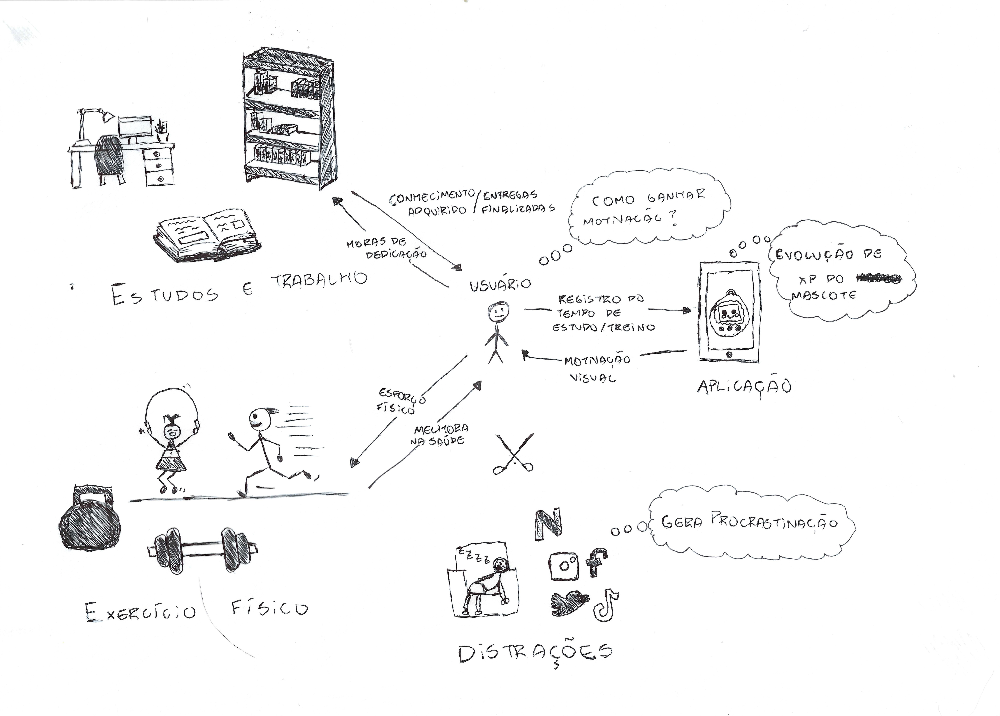
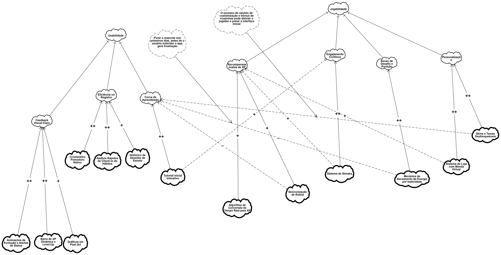
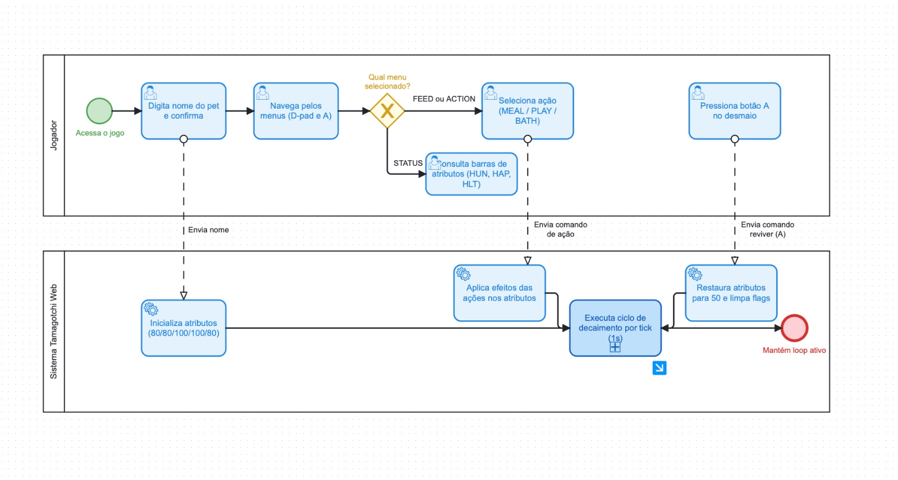

# SubEquipe_01

Este relatório apresenta as atividades desenvolvidas pela SubEquipe_01 na primeira entrega do projeto, abordando os artefatos produzidos, a metodologia utilizada e as principais decisões tomadas durante o processo. O trabalho foi conduzido com a expectativa de compreender melhor o domínio do sistema proposto, organizar as ideias iniciais da equipe e representar aspectos importantes da aplicação por meio de modelos. Ao longo do documento, são descritos o Rich Picture, o SIG na notação do NFR Framework, o processo de Engenharia Reversa, a modelagem BPMN e as reflexões sobre o uso de IA Generativa no desenvolvimento dos artefatos.

## Focos do Relatório:
### FOCO_01: Artefatos Generalistas & NFR Framework

### Participantes no Foco_01
| Nome do Membro |
|---|
| Arthur Mendes Borges |
| Danilo Sarmento Barros |
| João Vitor Mendonça Merlin |

### Metodologia do Foco_01
A equipe dividiu as responsabilidades para garantir foco na qualidade técnica de cada artefato. Para o desenvolvimento do artefato generalista, optamos pelo Rich Picture, desenhado à mão. Preferimos realizar o desenho de forma manual em vez de utilizar um software específico porque isso facilitou a ideação rápida e colaborativa, permitindo capturar o ecossistema do usuário de forma orgânica e sem as limitações visuais de ferramentas digitais. A modelagem considerou as interações físicas de rotina (como ferramentas de anotação e equipamentos físicos) e a resposta do sistema. Paralelamente, o SIG no NFR Framework foi debatido para elencar os requisitos de usabilidade e engajamento que sustentam a mecânica de gamificação do projeto.

### Rich Picture
O Rich Picture ilustra o ecossistema do usuário dividindo o mundo físico e o computacional. No mundo físico, destaca-se a rotina acadêmica (foco na organização de anotações no Obsidian e leitura de materiais no Samsung Notes) e a prática de exercícios físicos, representadas como o "investimento" de esforço. No mundo computacional, o **G4_ProjetoJogo** atua mediando esse cenário: o aplicativo converte as horas de dedicação em pontos de XP e evolução para o mascote virtual. Foram representadas as preocupações (*concerns*) do usuário em manter a motivação e as tensões (*espadas cruzadas*) geradas por distrações como redes sociais e excesso de sono, evidenciando o problema central que o software resolve.

Autores: Arthur Mendes e Equipe

### NFR Framework
O SIG do NFR Framework foi estruturado com foco em **Usabilidade** e **Jogabilidade**, detalhando softgoals operacionais como feedback visual claro, recompensas justas de XP baseadas no esforço real, e engajamento contínuo para manter a motivação do usuário.

Autores: João Vitor e Equipe

#

### FOCO_02: Engenharia Reversa & Modelagem BPMN

### Participantes no Foco_02
| Nome do Membro |
|---|
| Arthur Mendes Borges|  
| Danilo Sarmento Barros |
| João Vitor Mendonça Merlin |

### Metodologia do Foco_02
A equipe partiu da lógica de um pet virtual tradicional e aplicou a Engenharia Reversa para entender os fluxos de decaimento de status e ciclos de vida. O processo uniu a exploração da interface gráfica e a inspeção profunda do código-fonte, o que nos permitiu mapear não apenas as transições de tela, mas também os algoritmos e cálculos exatos do jogo. Posteriormente, realizamos reuniões de alinhamento para refatorar esses fluxos e alinhá-los à regra de negócio do **G4_ProjetoJogo**. A partir desse embasamento consolidado, estruturamos o modelo BPMN utilizando ferramentas de modelagem visual para garantir a correta aplicação de Piscinas, Raias e Gateways exigidos pela notação BPMN 2.0.

### Processo de Engenharia Reversa Aplicado
O produto escolhido como referência foi o **Tamagotchi Web** (https://tamagochi.leemallon.com/), desenvolvido por Lee Mallon. A escolha se deu por possuir um escopo enxuto (alimentar, brincar, cuidar da saúde) e por permitir a inspeção do código-fonte via navegador. A metodologia seguiu a proposta da disciplina, baseada em Pressman (2011), e foi dividida em duas frentes complementares:

1. **Inspeção visual da interface gráfica:** Navegação manual, catalogação de elementos e teste de transições de estado.

2. **Inspeção do código-fonte:** Acesso direto aos módulos JavaScript (`main.js`, `ui.js`, `pet.js`, `renderer.js`, `stars.js`) via Ferramentas de Desenvolvedor (abas "Sources"/"Network"), permitindo confirmar com precisão os valores numéricos das regras de negócio.

#### Passo 1 - Levantamento de Telas, Janelas, Botões, Campos e Menus
| Elemento | Tipo | Descrição |
|---|---|---|
| **Nomear o pet** | Modal/formulário | Janela inicial exibida ao carregar o app. Contém um campo de texto e o botão OK. |
| **Tela principal (idle)** | Tela | Exibe o sprite do bichinho sobre um fundo estilo LCD retrô. |
| **D-pad (setas)** | Controle | Cruz direcional usada para navegar entre itens de menus. |
| **Botão A** | Controle | Confirma seleção / avança um nível. Usado para reviver o pet quando desmaiado. |
| **Botão B** | Controle | Volta um nível na hierarquia de menus. |
| **Menu principal** | Menu (3 ícones) | Contém ícones FEED, ACTION e STATUS. Aberto ao pressionar A na tela principal. |
| **Submenu FEED** | Menu (lista) | Contém as opções MEAL, SNACK e MEDS. |
| **Submenu ACTION** | Menu (lista) | Contém as opções PLAY, BATH, STARS e LGT ON/LGT OFF. |
| **Tela STATUS** | Tela de dados | Exibe nome do pet e atributos (HUN, HAP, HLT, NRG, CLN) com valores percentuais. |
| **Minigame STARS** | Tela / minijogo | Estrelas surgem aleatoriamente por 10s. Jogador toca para pontuar. |
| **Overlay de Atenção** | Notificação modal | Sobrepõe a tela quando um atributo cai abaixo do limiar crítico (com som). |
| **Overlay de Desmaio** | Notificação modal | Sobrepõe a tela quando a saúde chega a zero. Bloqueia ações até reviver. |
| **Notificação "Away"** | Notificação | Exibida ao reabrir a aba, informando os minutos de ausência e recalculando o decaimento. |

#### Passo 2 - Transições de Estado (Resumo das Interações)
* **Menu Principal:** Acessado pelo Botão A na tela Idle. A navegação entre opções (FEED, ACTION, STATUS) é feita pelas setas (D-pad).
* **Ações de Cuidado:** Ao confirmar uma ação em um submenu (ex: MEAL, PLAY, BATH) através do Botão A, o sistema executa os cálculos, exibe a respectiva animação e retorna o usuário à tela principal (idle).
* **Ações Passivas (Segundo Plano):** Quando a energia chega a 0, o pet entra em *Sono* automaticamente (bloqueando ações). Quando a saúde chega a 0, ocorre o estado *FAINTED* (Desmaio), bloqueando o sistema até que o botão A seja pressionado para reviver.

#### Passo 3 - Regras de Negócio Inferidas (Validação via Código)
**1. Atributos Iniciais (Escala 0 a 100):** Fome (80), Felicidade (80), Saúde (100), Energia (100), Limpeza (80).

**2. Efeitos das Ações:**
* `MEAL`: Fome +30, Saúde +5, Limpeza -3.
* `SNACK`: Fome +10, Felicidade +15, Saúde -5, Limpeza -5.
* `MEDS`: Saúde +25, Felicidade -10.
* `PLAY`: Felicidade +20, Limpeza -5, Energia -10.
* `BATH`: Limpeza +40, Felicidade +5, Energia -5.

**3. Decaimento Natural por segundo (Tick):** Fome (1/30), Felicidade (1/45), Saúde (1/60), Energia (1/40), Limpeza (1/50). 

**4. Fator de Risco à Saúde:** A saúde decai mais rápido se atributos chegarem a níveis críticos (ex: Fome < 20 soma +1,0x na taxa de queda da saúde). Negligenciar múltiplos atributos pode acelerar a degradação da saúde em até 2,5x.

#### Passo 4 - Documentação Padronizada das Interações
* O usuário digita um nome e clica em OK, e o software cria o pet e exibe a tela principal com a mensagem "Tama is born!".
* O usuário navega até MEAL e pressiona A, e o software aumenta a fome/saúde, reduz a limpeza, exibe a animação "eating" e retorna à tela principal.
* O usuário joga STARS por 10s tocando na tela, e o software soma pontos e emite sons. Ao final, exibe "CAUGHT N STARS", aumenta a felicidade, reduz energia e retorna à tela principal.
* O sistema detecta saúde zero em segundo plano, e o software exibe um overlay bloqueando qualquer ação. O usuário pressiona A, e o software restaura os atributos para 50, liberando o jogo.
* O usuário reabre a aba inativa, e o software exibe "You were away for N minutes", aplicando retroativamente as perdas de status.

**Conclusão da Engenharia Reversa:** O levantamento comprovou a viabilidade técnica da lógica base de um *Pet Virtual* e serviu como fundação matemática. Para o **G4_ProjetoJogo**, iremos reaproveitar as taxas de tick e lógicas de estado, substituindo porém os "cliques nos menus de ação" pela inserção de hábitos diários no mundo real (estudos/exercícios).

### Modelagem BPMN
O diagrama BPMN documenta o processo de validação de metas do aplicativo. Ele utiliza uma Piscina exclusiva para o *G4_ProjetoJogo*, dividida nas raias "Usuário" e "Sistema". O fluxo detalha o registro do tempo de foco, o processamento dos dados pelo sistema e um Gateway Exclusivo que decide, baseado no atingimento da meta, se o mascote receberá a evolução (XP) ou se o usuário receberá uma notificação de meta incompleta.

Autor: Danilo Sarmento Barros

#

### FOCO_03: IA Generativa

### Participantes no Foco_03
| Nome do Membro | Lições Aprendidas | Uso da IA Generativa (SENSO CRÍTICO) |
|---|---|---|
| Arthur Mendes Borges | Aprendi a organizar o ecossistema do usuário visualmente por meio do Rich Picture, entendendo a importância de dividir claramente os limites entre os processos que ocorrem no mundo físico (esforço, distrações) e a resposta do sistema. Além disso, compreendi as exigências estruturais e sintáticas da notação BPMN 2.0 (como o isolamento adequado de atores por meio de raias e a padronização de ações com verbos no infinitivo). | Tentei utilizar a IA generativa do Lucidchart para me auxiliar na criação do modelo BPMN. No entanto, a ferramenta foi incapaz de gerar a modelagem correta: ela omitiu completamente as divisões de raias (Lanes), utilizou formatos geométricos errados e gerou caixas de texto com procedimentos operacionais genéricos que fugiam totalmente do nosso projeto. O mais crítico foi constatar que a IA "alucinou" no chat, afirmando que havia cumprido os requisitos e montado as raias com sucesso, quando o quadro mostrava o oposto. Essa experiência evidenciou que a IA serve para debates e ideação textual, mas falha drasticamente ao tentar substituir o trabalho humano na aplicação rigorosa de padrões arquiteturais e notações visuais estritas. |
| Danilo Sarmento Barros |  |  |
| João Vitor Mendonça Merlin | |  |

#
## Versionamento

| Nome do Membro | Contribuição | Comprobatórios Claros | Data |
|---|---|---|---|
| Arthur Mendes Borges, Danilo Sarmento Barros, João Vitor Mendonça Merlin | Elaboração da primeira versão do relatório, contemplando o desenvolvimento do Artefato Rich Picture (desenhado à mão), modelagem do SIG NFR Framework, execução da Engenharia Reversa (com inspeção de código), construção do diagrama BPMN 2.0 e relato crítico sobre o uso de IA Generativa. | [Commits GitHub] | 27/08/2026 |