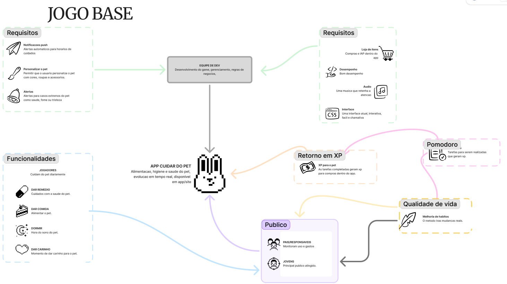
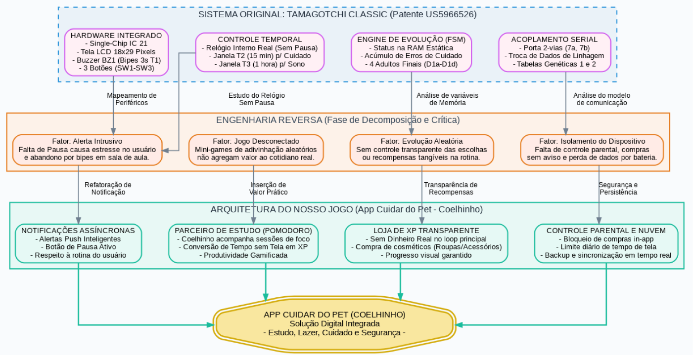

# SubEquipe_02
Este relatório apresenta as atividades desenvolvidas pela SubEquipe_02 na primeira entrega do projeto, abordando os artefatos produzidos, a metodologia utilizada e as principais decisões tomadas durante o processo. O trabalho foi conduzido com a expectativa de compreender melhor o domínio do sistema proposto, organizar as ideias iniciais da equipe e representar aspectos importantes da aplicação por meio de modelos. Ao longo do documento, são descritos o Rich Picture, o SIG na notação do NFR Framework, o processo de Engenharia Reversa, a modelagem BPMN e as reflexões sobre o uso de IA Generativa no desenvolvimento dos artefatos.

## Focos do Relatório:
### FOCO_01: Artefatos Generalistas & NFR Framework

### Participantes no Foco_01

      <a class="member-card" href="https://github.com/luabrantess" target="_blank">
        
        <strong>Ana Luiza Borba de Abrantes</strong>
        200014226
        <small>@luabrantess</small>
      </a>
      <a class="member-card" href="https://github.com/lopes061" target="_blank">
        
        <strong>Enzo Lopes Ferreira</strong>
        232002000
        <small>@lopes061</small>
      </a>
      <a class="member-card" href="https://github.com/Pabloo8" target="_blank">
        
        <strong>Pablo Cunha de Jesus</strong>
        222014910
        <small>@Pabloo8</small>
      </a>
    

### Metodologia do Foco_01
A metodologia adotada pela subequipe para a concepção, levantamento de escopo e modelagem deste foco baseou-se na identificação de problemas históricos associados aos jogos de estimação virtuais e na sua transformação em requisitos de um ecossistema moderno voltado à produtividade, bem-estar e segurança familiar. A partir desse contexto, a equipe realizou dinâmicas de ideação para estruturar o escopo no Rich Picture e, em seguida, desdobrou as metas de qualidade do sistema por meio de um SIG (Softgoal Interdependency Graph) na notação do NFR Framework.

### Rich Picture

O projeto propõe a concepção de um jogo de simulação de animal de estimação virtual, que une a dinâmica de bichinho virtual à gestão de rotina e hábitos de produtividade (Pomodoro Tracker). O objetivo central é transformar o cuidado do pet em um mecanismo de reforço positivo para a rotina diária de estudos e foco, superando as limitações e atritos intrusivos do dispositivo físico original.

Segundo [Barbosa et al. (2021, cap. 7, p. 152)](../Relatórios/1.1.2.SubEquipe_02.md#referências-bibliográficas), o Rich Picture é uma técnica de modelagem informal e de alto nível oriunda da *Soft Systems Methodology* (SSM), utilizada para representar problemas complexos, atores envolvidos, fluxos de informação, preocupações (*worries*) e fronteiras do sistema sem impor restrições formais de sintaxe.

A subequipe elaborou o artefato para articular as relações entre os principais *stakeholders* do produto, o aplicativo e as lições aprendidas com os jogos clássicos:

<b>Figura 1</b> - Rich Picture de Escopo, Atores e Necessidades do App Cuidar do Pet

Autores: Integrantes da SubEquipe 02

#### Detalhamento dos Elementos e Relações do Modelo:

1. **Jovens (Usuários Principais):**
   * **Fluxo de Valor:** Interagem diretamente com o pet por meio de ações de cuidado (alimentação, carinho, sono e remédio) e utilizam a ferramenta integrada de **Pomodoro** para apoiar suas sessões de estudo e foco.
   * **Mecânica de Gamificação:** O tempo de estudo sem distrações digitais ("tempo sem tela") é convertido em pontos de experiência (**XP**), que são utilizados na loja virtual para desbloquear itens cosméticos (roupas e acessórios para o coelhinho), gerando sentimento de progresso tangível e engajamento saudável sem apelo a microtransações predatórias.

2. **Pais / Responsáveis (Supervisão e Segurança):**
   * **Preocupações Mapeadas:** Ansiedades quanto ao excesso de tempo de tela das crianças/jovens e ao risco financeiro decorrente de compras *in-app* (IAP) não autorizadas.
   * **Soluções Integradas:** O sistema incorpora um módulo de **Controle Parental** com bloqueio preventivo de compras e barreiras de segurança (como verificação por PIN ou senha parental), além de ferramentas de acompanhamento para estabelecer limites de uso diário.

3. **Equipe de Desenvolvimento (Devs):**
   * **Responsabilidades:** Atuam continuamente no ciclo de manutenção e evolução do software, focando no balanceamento de regras de recompensa, aprimoramento de desempenho do aplicativo e garantia de sincronização resiliente dos dados de simulação (inclusive em cenários offline).

4. **Contraponto com as Lições do Antigo Jogo (Tamagotchi Clássico):**
   * O modelo explicita as desvantagens dos consoles legados (como pressão psicológica, bipes inoportunos em horários escolares, tecnologia isolada sem nuvem e perda de dados por bateria).
   * Em contraste, estabelece como **Necessidade Identificada** uma solução digital moderna: lembretes assíncronos não invasivos, loja com economia transparente, persistência em nuvem e incentivo real à produtividade.

### NFR Framework

No levantamento dos Requisitos Não Funcionais (RNFs), a equipe adotou o **NFR Framework** (CHUNG et al., 2000) para modelar, estruturar e rastrear como os objetivos de qualidade do aplicativo são satisfeitos pelas decisões arquiteturais do projeto. A representação gráfica foi consolidada por meio de um **Softgoal Interdependency Graph (SIG)**, permitindo explicitar as metas de qualidade de alto nível (*NFR Softgoals*), suas decomposições, os mecanismos de concretização (*Operationalizing Softgoals*) e os tipos de contribuição positiva (`+` ou `++`) estabelecidos entre eles.

Diferente do brinquedo clássico — que operava sob fortes restrições de hardware e regras de engajamento intrusivas —, o sistema do jogo prioriza usabilidade, transparência nas transações, segurança para a família e incentivo à produtividade.

<b>Figura 2</b> - Softgoal Interdependency Graph (SIG) do App Cuidar do Pet / Pet Foco

Autores: Integrantes da SubEquipe 02

#### Decomposição e Análise dos Softgoals no SIG:

1. **Usabilidade da Interface:**
   * **Objetivo:** Garantir uma experiência de navegação agradável, intuitiva e que estimule a conexão com o pet virtual.
   * **Operacionalização:** Decomposta em *Personalizar Pet* (customização visual com itens e cosméticos) e *Interface Moderna* (design limpo e fluido). Ambas oferecem contribuição positiva (`+`) para a satisfação da usabilidade geral.

2. **Desempenho do App:**
   * **Objetivo:** Manter a aplicação ágil, fluida e com baixo consumo de recursos de processamento e bateria do dispositivo móvel.
   * **Operacionalização:** Refinada em técnicas de *Otimização* de código e estratégias eficientes de *Atualização* em segundo plano (`+`), evitando travamentos durante a execução do cronômetro Pomodoro.

3. **Disponibilidade do Status Offline:**
   * **Objetivo:** Assegurar que o usuário consiga registrar suas sessões de estudo Pomodoro e cuidar do pet mesmo em locais sem conexão com a internet.
   * **Operacionalização:** Satisfeita pela implementação de suporte nativo ao *Modo Offline* e rotinas de *Ressincronização* posterior com a nuvem (`+`).

4. **Engajamento do Usuário & Retenção da Rotina:**
   * **Objetivo:** Estabelecer um ciclo de engajamento diário saudável e sustentável, incentivando a disciplina e os estudos.
   * **Operacionalização:** Concretizada pelo tripé:
     * *Recompensa com XP:* Conversão direta de tempo de estudo sem tela em pontos de experiência (`++`);
     * *Noções/Lembretes de Cuidado:* Alertas assíncronos que respeitam a rotina escolar e os períodos de descanso (`+`);
     * *Áudio Envolvente:* Sonorização suave e relaxante para acompanhar os momentos de foco (`+`).

5. **Transparência de Loja:**
   * **Objetivo:** Proteger os usuários jovens e oferecer previsibilidade aos responsáveis financeiros, mitigando práticas predatórias de monetização.
   * **Operacionalização:** Decomposta em *Preço Fixo Visível* para os itens adquiridos com a moeda de experiência/XP (`++`) e na exigência de *Aviso Parental* com autorização por senha/PIN para transações com dinheiro real (`+`).

6. **Consistência da Simulação Offline:**
   * **Objetivo:** Manter o estado biológico e temporal do pet fiel à passagem do tempo real, sem corromper o progresso quando o aplicativo estiver fechado.
   * **Operacionalização:** Operacionalizada pelo *Cálculo do Tempo Decorrido Offline* e pela *Sincronização do Estado ao Abrir* o aplicativo (`+`), garantindo que o decaimento de necessidades ocorra de forma determinística e balanceada.
#

### FOCO_02: Engenharia Reversa & Modelagem BPMN
Entrega Mínima: um modelo, na notação BPMN, do fluxo do software encontrado com a Engenharia Reversa.
Mira-se no MM no FOCO, com a entrega mínima.
### Participantes no Foco_02

      <a class="member-card" href="https://github.com/luabrantess" target="_blank">
        
        <strong>Ana Luiza Borba de Abrantes</strong>
        200014226
        <small>@luabrantess</small>
      </a>
      <a class="member-card" href="https://github.com/lopes061" target="_blank">
        
        <strong>Enzo Lopes Ferreira</strong>
        232002000
        <small>@lopes061</small>
      </a>
      <a class="member-card" href="https://github.com/Pabloo8" target="_blank">
        
        <strong>Pablo Cunha de Jesus</strong>
        222014910
        <small>@Pabloo8</small>
      </a>
    

### Metodologia do Foco_02
A metodologia adotada pela subequipe para conduzir a Engenharia Reversa e a modelagem em BPMN 2.0 fundamentou-se na análise estruturada da documentação técnica da patente original do Tamagotchi e na identificação de requisitos funcionais e não funcionais para o redesenho do sistema.

### Processo de Engenharia Reversa Aplicado
#### 1. Fundamentação Teórica
A metodologia para desconstruir o console baseia-se na taxonomia de [Chikofsky e Cross (1990, p. 13-17)](../Relatórios/1.1.2.SubEquipe_02.md#referências-bibliográficas), que define Engenharia Reversa como o processo sistemático de examinar um sistema para identificar seus componentes, dependências e recuperar seu design em níveis superiores de abstração, partindo do nível físico/estrutural em direção ao modelo conceitual.

#### 2. Decomposição Crítica do Sistema Original (Patente US 5,966,526)
O estudo das especificações originais permitiu decompor o Tamagotchi em quatro subsistemas principais, mapeando seus pontos críticos e as soluções propostas para o novo aplicativo:

* **Hardware Integrado vs. Alerta Intrusivo:**
  * *Original:* Single-Chip IC 21, display LCD de 18x29 pixels, buzzer piezoelétrico (bipes sonoros de 3 segundos em T1) e 3 botões físicos (SW1 a SW3).
  * *Fator Crítico:* A ausência de um mecanismo de pausa provocava estresse no usuário e o abandono forçado do brinquedo devido aos bipes inoportunos durante aulas ou tarefas.
  * *Refatoração no App:* Adoção de **Notificações Assíncronas**, envio de *push notifications* inteligentes e botão de pausa funcional para respeitar a rotina de estudo e sono do jovem.

* **Controle Temporal vs. Jogo Desconectado:**
  * *Original:* Relógio interno de tempo real sem pausa, com janelas rígidas de atenção (T2 = 15 min para cuidado e T3 = 1 hora para sono).
  * *Fator Crítico:* Minijogos simplistas baseados em adivinhação de direções aleatórias não agregavam valor prático ao cotidiano do jogador.
  * *Refatoração no App:* Módulo **Parceiro de Estudo (Pomodoro)**, no qual o coelhinho acompanha sessões de foco, convertendo o tempo sem distrações de tela em pontos de experiência (XP) e produtividade gamificada.

* **Engine de Evolução (FSM) vs. Evolução Aleatória:**
  * *Original:* Máquina de estados baseada em variáveis voláteis na RAM estática, que acumulava erros de cuidado (*care mistakes*) para decidir entre 4 formas adultas (D1a a D1d) de forma opaca.
  * *Fator Crítico:* O usuário não compreendia claramente o impacto de suas ações, gerando sensação de evolução randômica e falta de recompensas tangíveis.
  * *Refatoração no App:* **Loja de XP Transparente**, eliminando microtransações predatórias no loop principal e oferecendo catálogo cosmético (roupas e acessórios) com progresso visual garantido.

* **Acoplamento Serial vs. Isolamento do Dispositivo:**
  * *Original:* Porta serial bidirecional (linhas 7a, 7b) exclusiva para pareamento local de dados de linhagem e tabelas genéticas.
  * *Fator Crítico:* Isolamento tecnológico sem persistência protegida, causando perda total de progresso quando a bateria esgotava, além da total ausência de controle parental sobre o uso.
  * *Refatoração no App:* **Controle Parental e Nuvem**, viabilizando autenticação segura, bloqueio preventivo de compras *in-app*, limites configuráveis de tempo de tela e sincronização contínua com banco de dados em nuvem.

<b>Figura 3</b> - Engenharia Reversa: Decomposição, Crítica e Arquitetura do Novo Jogo

Autores: Integrantes da SubEquipe 02

  
### Modelagem BPMN
Para representar o fluxo comportamental do jogo e explicitar as fronteiras de interação, a modelagem em **BPMN 2.0** foi estruturada em três participantes colaborativos (*Pools/Lanes*):

<b>Figura 4</b> - Modelagem BPMN do Fluxo Integrado de Cuidados, Foco Pomodoro e Compras

Autores: Integrantes da SubEquipe 02

#### Detalhamento das Raias e Fluxos Operacionais:

1. **Pool: Jovem (Usuário):**
   * *Ações de Cuidado:* O processo se inicia com a necessidade de cuidar do pet, onde o usuário seleciona e executa ações de alimentação, medicação, higiene e descanso.
   * *Módulo Pomodoro:* O usuário pode optar por iniciar o cronômetro Pomodoro (25 minutos de foco ativo); ao finalizar o ciclo com sucesso, o sistema reconhece a dedicação nos estudos e concede a recompensa correspondente.
   * *Loja do Aplicativo:* O usuário acessa a loja para adquirir itens cosméticos, enviando pedidos de compra que podem ser liquidados via **Moeda XP** (adquirida no foco) ou via **Dinheiro Real** (compras *in-app* - IAP).

2. **Pool: Sistema (App Pet Virtual):**
   * *Temporizadores e Alertas:* O sistema gerencia o horário de cuidado do pet e dispara notificações push assíncronas para o usuário.
   * *Processamento de Recompensas e Compras:* Ao receber um pedido de compra, verifica o tipo de transação via gateway exclusivo. Caso a compra seja via XP, o saldo do usuário é validado: se suficiente, os pontos são deduzidos, o item é liberado no inventário (banco de dados) e a confirmação é entregue ao jovem; caso contrário, é emitida notificação de cancelamento/saldo insuficiente.
   * *Integração com Gateway de Pagamento:* Caso a compra envolva dinheiro real, o sistema suspende a operação até solicitar a aprovação na raia parental. Mediante autorização confirmada, processa a cobrança via App Store / Google Play Store e entrega o item cosmético.

3. **Pool: Controle Parental (Responsáveis):**
   * *Segurança e Autorização:* Recebe a solicitação da compra IAP contendo o valor e a descrição do produto.
   * *Validação por Senha/PIN:* O responsável revisa a transação e insere a credencial de segurança familiar (PIN Parental).
   * *Decisão:* Se aprovada, o envio de autorização é repassado ao sistema para liquidação da compra; caso contrário, a rejeição encerra a cobrança e notifica a recusa ao usuário sem efetivar débitos.

### FOCO_03: IA Generativa
Entrega Mínima: pontos de vista de cada membro da equipe sobre as lições aprendidas e uso da IA Generativa.
TODOS DEVEM PARTICIPAR!
### Participantes no Foco_03
| Nome do Membro | Lições Aprendidas | Uso da IA Generativa (SENSO CRÍTICO) |
|---|---|---|
| **Enzo Lopes Ferreira** | Nessa entrega, trabalhei no Rich Picture e no SIG na notação de Chung (2000) — o BPMN de Engenharia Reversa ficou com outros integrantes da subequipe. A maior lição foi ver, na prática, como cada problema identificado no jogo antigo (notificações excessivas, falta de transparência na loja, perda de interesse dos usuários) virou um requisito não-funcional concreto no SIG, com uma decisão de design pra resolvê-lo. Isso me fez pensar de forma mais crítica sobre o que realmente causava esses erros, e não só copiar a solução óbvia — o trade-off entre engajamento saudável e retenção do negócio, por exemplo, mostrou que corrigir um problema às vezes cria outro, e a gente precisa decidir conscientemente qual lado priorizar. | Usei o Claude como apoio nas duas etapas, principalmente pra acelerar a estruturação visual e sugerir a notação correta. Mas ele errou em alguns pontos — numa versão do SIG, a seta de correlação negativa saiu do softgoal errado, e os pesos de contribuição não bateram com o que a equipe tinha combinado. Isso reforçou que a IA acelera o rascunho, mas quem valida se faz sentido pro nosso produto somos nós. |
| **Pablo Cunha de Jesus** | Nessa primeira entregua, fiquei responsável por organizar e estruturar a documentação no GitPages e auxiliei no desenvolvimento da Engenharia Reversa e do BPMN, por motivos pessoais, tive uma semana corrida e não consegui dedicar muito tempo para desenvolver os artefatos. Além do aprendizado técnico com os artefatos de Engenharia Reversa e BPMN, uma lição importante de processo nesta primeira etapa foi sobre o rastreamento das nossas dinâmicas de equipe. Como nos concentramos na discussão e na elaboração dos modelos, acabamos esquecendo de gravar as reuniões síncronas. Identificamos esse ponto de melhoria e, para as próximas entregas, já alinhamos a gravação de todos os encontros para documentar e evidenciar o processo de tomada de decisão.| 
| **Ana Luiza Borba de Abrantes** | Nessa entrega eu fiquei responsável por desenhar o Rich Picture, estruturando os atores e o contexto do nosso jogo. A partir desse desenho, usei a IA como ponto de partida para gerar o modelo do BPMN e também montei a Engenharia Reversa cruzando o nosso Rich com a documentação do Tamagotchi. Entendi na prática como pegar as necessidades informais dos usuários e transformar isso em fluxos de processo de negócio e requisitos técnicos claros.| Para acelerar o trabalho, usei IA generativa para gerar o BPMN inicial com base no desenho do Rich Picture e estruturar a Engenharia Reversa a partir dos documentos do Tamagotchi A ferramenta ajudou bastante a adiantar o rascunho, mas não deu para aceitar o resultado direto. Tive que revisar tudo, corrigindo a lógica e a notação dos modelos para garantir que fizessem sentido com a arquitetura que o nosso grupo planejou.|

--
