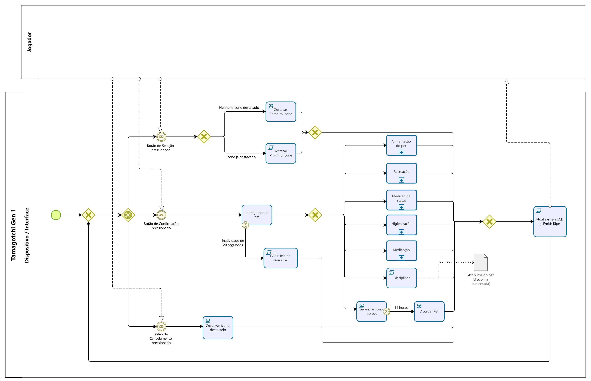
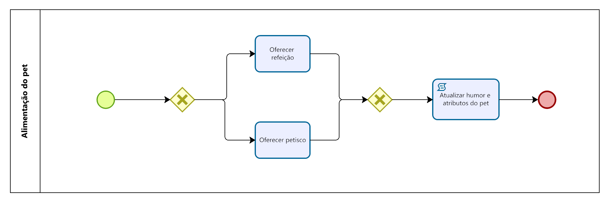
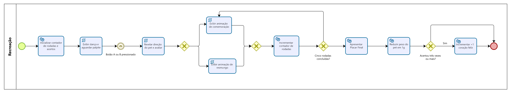
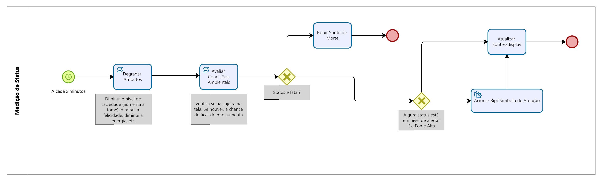
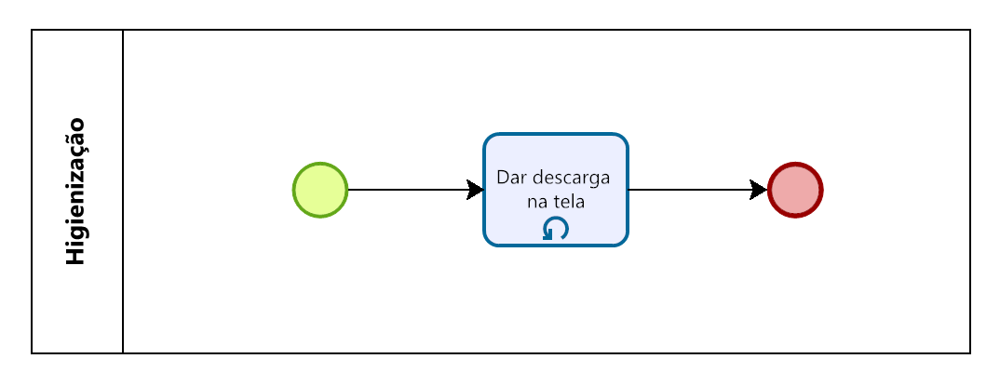
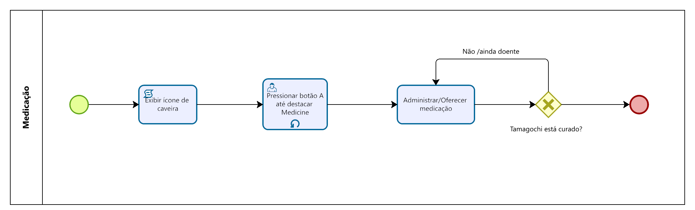

# SubEquipe_03

Este relatório apresenta as atividades desenvolvidas pela SubEquipe_03 na primeira entrega do projeto, abordando os artefatos produzidos, a metodologia utilizada e as principais decisões tomadas durante o processo. O trabalho foi conduzido com a expectativa de compreender melhor o domínio do sistema proposto, organizar as ideias iniciais da equipe e representar aspectos importantes da aplicação por meio de modelos. Ao longo do documento, são descritos o Mapa Mental, o SIG na notação do NFR Framework, o processo de Engenharia Reversa, a modelagem BPMN e as reflexões sobre o uso de IA Generativa no desenvolvimento dos artefatos.

## Focos do Relatório:
### FOCO_01: Artefatos Generalistas & NFR Framework

### Participantes no Foco_01

  <a class="member-card" href="https://github.com/EduardoRGS" target="_blank">
    
    <strong>Eduardo Ribeiro Gomes da Silva</strong>
    190027011
    <small>@EduardoRGS</small>
  </a>
  <a class="member-card" href="https://github.com/bielg7" target="_blank">
    
    <strong>Gabriel Pereira da Silva</strong>
    221008641
    <small>@bielg7</small>
  </a>
  <a class="member-card" href="https://github.com/guin409" target="_blank">
    
    <strong>Guilherme Negreiros Pereira</strong>
    232014001
    <small>@guin409</small>
  </a>
  <a class="member-card" href="https://github.com/vevetin" target="_blank">
    
    <strong>Weverton Rodrigues da Costa Silva</strong>
    221022767
    <small>@vevetin</small>
  </a>

### Metodologia do Foco_01

A metodologia adotada pela subequipe para a concepção e modelagem deste foco baseou-se na análise do Tamagotchi P1 e de aplicações relacionadas a hábitos saudáveis, como ferramentas de Pomodoro e rastreadores de ingestão de água. A partir dessas referências, a equipe discutiu possibilidades para o aplicativo e organizou as ideias em um **Mapa Mental**, utilizado para estruturar o escopo e as relações entre suas funcionalidades.

O processo foi dividido em três etapas:

1. **Ideação inicial:** O escopo inicial do aplicativo partiu de uma proposta apresentada pelo integrante Gabriel Pereira. A ideia consistia em um pet virtual educativo voltado ao acompanhamento de hábitos saudáveis, relacionando seu desenvolvimento e evolução à realização de sessões de foco baseadas na técnica Pomodoro. Os atributos do pet reagiriam às tags mais utilizadas e à frequência das atividades realizadas no cronômetro, como estudos e leituras.

2. **Exploração e elicitação coletiva (divergência):** A partir da proposta inicial, a subequipe analisou o funcionamento do Tamagotchi P1 e referências de aplicativos voltados ao acompanhamento de hábitos. As ideias foram discutidas coletivamente em sessões de brainstorming, nas quais a equipe explorou diferentes possibilidades para o aplicativo e seus requisitos [(Barbosa et al., 2021, cap. 7, p. 152)](../Relatórios/1.1.3.SubEquipe_03.md#referências-bibliográficas). Esse processo ampliou o escopo inicial e levou à definição de novas possibilidades de interação e gamificação, entre elas:

   - A diversificação do sistema de evolução do pet em categorias de experiência (XP intelectual, atlético, saúde e geral), relacionadas a hábitos como ingestão de água, meditação e exercícios físicos;

   - Um sistema de economia interna com loja de itens, incluindo acessórios, roupas e temas para personalização do pet e da interface, com moedas e selos obtidos por *streaks* de hábitos;

   - Um modelo de decaimento de status para representar o comportamento biológico e psicológico do pet, produzindo estados como feliz, desmotivado, estressado e triste de acordo com o autocuidado do usuário.

3. **Consolidação e modelagem (convergência):** Para organizar as referências analisadas e as ideias desenvolvidas pela equipe, a subequipe realizou uma oficina colaborativa para construir o Mapa Mental da aplicação. O mapa reuniu elementos identificados no Tamagotchi P1 e em aplicações relacionadas a hábitos saudáveis, além das propostas discutidas pela equipe. Segundo [Silva (2010, p. 12)](../Relatórios/1.1.3.SubEquipe_03.md#referências-bibliográficas), mapas mentais podem ser utilizados para classificar, representar e comunicar relações cognitivas, apoiando também processos de tomada de decisão. A técnica permitiu organizar as ideias de maneira não linear e estabelecer relações entre as funcionalidades previstas para a aplicação. A partir dessa consolidação, a equipe também identificou requisitos não funcionais relevantes para a experiência do usuário e para o funcionamento do sistema, estruturando-os em um SIG na notação do NFR Framework, de modo a explicitar relações de contribuição, priorização e possíveis conflitos entre objetivos de qualidade. Como o mapeamento foi realizado de forma cooperativa, a subequipe definiu uma convenção comum de símbolos e palavras-chave para representar as informações, de modo que os artefatos finais refletissem as decisões compartilhadas pelo grupo.

> **Evidências:** as explicações em vídeo, as evidências de elaboração dos artefatos e as atas de reuniões estão disponíveis na seção de [Evidências da SubEquipe_03](../Evidências/1.1.3.SubEquipe_03.md).

### Mapa Mental

O projeto consiste em uma aplicação de Pet Virtual, Pomodoro e Tracker, inspirada em Tamagotchis e em estética pixel art, com o objetivo de apoiar a organização de atividades, a criação de hábitos saudáveis e a manutenção da produtividade. A proposta combina recursos como Pomodoro, calendário, cronômetro, contador de água e check-in de hábitos, relacionando as ações do usuário ao estado e à evolução de um pet virtual. Assim, aspectos como humor, energia, sede e motivação do pet funcionam como representações visuais do progresso e do cuidado do usuário com sua rotina.

<b>Figura 1</b> - Mapa Mental de Elicitação de Escopo e Funcionalidades do Pet Virtual

Autores: Gabriel Pereira, Guilherme Negreiros, Eduardo Ribeiro e Weverton Rodrigues

### NFR Framework

No levantamento dos Requisitos Não Funcionais (RNFs), a equipe priorizou aspectos de usabilidade, com base no modelo URPS+ (GRADY; CASWELL, 1987) e nos Requisitos de Produto de Sommerville (2019), dando atenção à eficiência da interação, ao feedback visual e à percepção de progresso. Esses aspectos orientaram decisões como a criação de uma interface intuitiva, o uso de tutorial interativo, atalhos para o Pomodoro e indicadores que facilitam a compreensão do estado do pet.

Além disso, as restrições relacionadas a design e interface, contempladas pelo “+” do URPS+, ajudaram a definir a identidade visual retrô da aplicação. Isso se refletiu na escolha de fontes pixeladas, renderização pixel perfect, escalonamento inteiro e uma paleta de cores reduzida. Dessa forma, os RNFs orientam não apenas a forma como o usuário interage com o sistema, mas também como suas informações são apresentadas.

<b>Figura 2</b> - Modelagem de Requisitos Não-Funcionais através do NFR Framework (SIG)

Autores: Gabriel Pereira, Guilherme Negreiros, Eduardo Ribeiro e Weverton Rodrigues

### FOCO_02: Engenharia Reversa & Modelagem BPMN

Este foco apresenta a recuperação da especificação comportamental e das regras de negócio do console portátil **Tamagotchi Gen 1 (P1)**. Por meio da análise sistemática do comportamento do hardware e da interface visual do brinquedo, abstraímos a dinâmica de interação física em um modelo de processo formalizado .

### Participantes no Foco_02

  <a class="member-card" href="https://github.com/EduardoRGS" target="_blank">
    
    <strong>Eduardo Ribeiro Gomes da Silva</strong>
    190027011
    <small>@EduardoRGS</small>
  </a>
  <a class="member-card" href="https://github.com/bielg7" target="_blank">
    
    <strong>Gabriel Pereira da Silva</strong>
    221008641
    <small>@bielg7</small>
  </a>
  <a class="member-card" href="https://github.com/guin409" target="_blank">
    
    <strong>Guilherme Negreiros Pereira</strong>
    232014001
    <small>@guin409</small>
  </a>
  <a class="member-card" href="https://github.com/vevetin" target="_blank">
    
    <strong>Weverton Rodrigues da Costa Silva</strong>
    221022767
    <small>@vevetin</small>
  </a>

### Metodologia do Foco_02

Espaço para contar um pouco sobre como ocorreu o trabalho em equipe. Vídeos ajudam aqui.

> **Evidências:** as explicações em vídeo, as evidências de elaboração dos artefatos e as atas de reuniões estão disponíveis na seção de [Evidências da SubEquipe_03](../Evidências/1.1.3.SubEquipe_03.md).

### Processo de Engenharia Reversa Aplicado

#### 1. Fundamentação Teórica

A metodologia utilizada para recuperar a arquitetura do Tamagotchi Gen 1 (P1) baseia-se na [taxonomia de Chikofsky e Cross (1990, p. 13-17)](../Relatórios/1.1.3.SubEquipe_03.md#referências-bibliográficas), que define Engenharia Reversa como o processo de análise de um sistema para identificar seus componentes, suas relações e representá-lo em níveis mais altos de abstração, partindo do nível físico em direção ao conceitual.

A investigação teve como foco principal a **análise estática**, realizada a partir de patentes históricas [(BANDAI CO., 1999, 2001)](../Relatórios/1.1.3.SubEquipe_03.md#referências-bibliográficas), documentação técnica e guias especializados [(THAAO'S TAMAS, [s.d.])](../Relatórios/1.1.3.SubEquipe_03.md#referências-bibliográficas) sobre o funcionamento do dispositivo. Essas fontes permitiram identificar características do hardware, da interface, dos mecanismos de controle e das regras internas relacionadas ao cuidado e à evolução do pet.

#### 2. Fontes Elicitadas e Achados Técnicos

A construção do modelo BPMN foi baseada no cruzamento de informações sobre funcionamento e interface obtidas nas patentes analisadas e em guias especializados da comunidade.

- **Patente US 5,966,526 (Akihiro Yokoi / Bandai, 1999)**

    A patente descreve aspectos da lógica de funcionamento, da interface e dos algoritmos relacionados ao comportamento do pet:

    - Mapeamento da interface e fluxo de navegação: apresenta a matriz gráfica da tela com 29 colunas por 18 linhas de pixels (*dots*) e a disposição fixa dos 10 ícones indicadores (*marks*), distribuídos entre as linhas superior e inferior da tela. Os ícones correspondem às funções de Alimentação, Iluminação, Recreação, Higiene, Disciplina, Medicação, Status, Linhagem, Reprodução e Atenção (*Call Mark*). A patente também descreve o uso dos três botões físicos: Botão A para percorrer os ícones, Botão B para confirmar a seleção e Botão C para cancelar a ação.

    - Ciclo de atenção e chamado (*Attention Call*): descreve o mecanismo pelo qual o sistema verifica os níveis de fome (*Hungry*) e felicidade (*Happy*). Quando esses valores atingem zero, o sistema ativa o *Call Mark* e emite um alerta sonoro, iniciando o período de tolerância para a resposta do usuário.

    - Lógica de cuidado e algoritmo de crescimento: apresenta o algoritmo *First/Second Growth Procedure* e a variável de controle *Degree of Care (Grau de Cuidado)*. Quando o jogador responde ao chamado dentro do tempo-limite, o valor é incrementado. Caso o chamado não seja atendido, ocorre um *Care Mistake (Erro de Cuidado)*, com redução do valor acumulado.

- **Patente US 6,213,871 B1 (Akihiro Yokoi / Bandai, 2001)**

    A patente apresenta outros aspectos do funcionamento do sistema, incluindo os mecanismos de feedback e as regras utilizadas nas transições de evolução:

    - Máquina de estados e evolução por afinidade: apresenta matrizes de decisão para os ramos evolutivos [(BANDAI CO., 2001,  fig. 11, 18)](../Relatórios/1.1.3.SubEquipe_03.md#referências-bibliográficas). Em determinados marcos de idade, o processador consulta as variáveis acumuladas *Degree of Care* e *Degree of Discipline* para determinar o ramo de desenvolvimento do pet. A decisão resulta na seleção de uma das variantes gráficas identificadas na patente como KT1 a KT13.

    - Ciclo de feedbacks ativos: descreve a relação entre as ações realizadas pelo usuário e as respostas produzidas pelo dispositivo. Entre essas respostas estão a ativação do buzzer piezoelétrico e a apresentação de animações gráficas na tela. Esses elementos fornecem retorno visual e sonoro após determinadas interações, como alimentação, recreação e outras ações de cuidado.

- **Comunidade e guias especializados (Thaao's Tamas Care & Character Guides)**

    Os guias especializados produzidos pela comunidade foram utilizados como fonte complementar para identificar parâmetros temporais e regras de comportamento que não estavam detalhados da mesma forma nas patentes.

    - Ciclo de vida e decaimento de status: apresentam os intervalos de tempo para o decaimento dos indicadores de fome e felicidade de acordo com a variante do pet. Esses valores permitem estabelecer a frequência com que determinadas condições de cuidado são atingidas durante o ciclo de vida.

    - Comportamento de sono e vigília: registram os horários de sono e vigília associados a diferentes personagens. Durante o período de sono, o estado do pet muda e determinadas interações deixam de estar disponíveis. O jogador precisa utilizar a função de iluminação para apagar a luz, permitindo que o pet permaneça dormindo.

#### 3. Transição: Da Programação Imperativa para o BPMN Reativo

Os fluxogramas presentes nas patentes de Yokoi descrevem uma lógica sequencial típica de microcontroladores dos anos 90, com varreduras repetitivas de registradores e condicionais em cascata (if/else).

Para representar esse comportamento em BPMN 2.0 de forma mais clara, foram aplicadas algumas abstrações:

- De varredura ativa para gateway de eventos: em vez de representar a CPU verificando continuamente se um botão foi pressionado, o estado idle foi modelado com um Gateway Baseado em Eventos [(IPROCESS, 2021)](../Relatórios/1.1.3.SubEquipe_03.md#referências-bibliográficas). O processo permanece aguardando até que um evento de entrada, como o acionamento de um botão, provoque a continuidade do fluxo.

- De timers de loop para eventos de tempo: a verificação do tempo de inatividade foi representada por um Evento Intermediário de Tempo [(IPROCESS, 2012)](../Relatórios/1.1.3.SubEquipe_03.md#referências-bibliográficas) (Timer de 15 s) concorrente no Gateway Baseado em Eventos. Quando o tempo é atingido, o fluxo segue para o encerramento da tela de menu caso não tenha ocorrido nenhuma interação.

- De desvios de código para subprocessos: as ações de cuidado foram organizadas em Subprocessos [(TCU, 2013)](../Relatórios/1.1.3.SubEquipe_03.md#referências-bibliográficas), como Alimentação e Recreação. Dessa forma, as regras de dados de menor nível ficam encapsuladas, enquanto o modelo principal permanece concentrado no comportamento observável e nos aspectos de interação humano-computador [(Barbosa et al., 2021,, cap. 6, p. 116)](../Relatórios/1.1.3.SubEquipe_03.md#referências-bibliográficas). 

### Modelagem BPMN
Com base no processo de Engenharia Reversa descrito anteriormente, a modelagem BPMN foi utilizada para representar, em um nível mais alto de abstração, o comportamento observado no Tamagotchi Gen 1. As regras identificadas nas patentes, nos guias especializados e na análise da interface foram organizadas em um fluxo principal e em subprocessos, permitindo separar a navegação geral do sistema das ações específicas de cuidado do pet.

O modelo principal concentra a interação do usuário com o dispositivo, incluindo a espera por eventos, a navegação pelos ícones, a seleção de funcionalidades, os eventos de tempo e os chamados de atenção. Já os subprocessos detalham comportamentos específicos, como alimentação, recreação, higiene, disciplina, status e demais ações associadas ao cuidado e à evolução do pet virtual.

#### Orquestração Comportamental e Ciclo Geral do Pet Virtual

O processo principal representa a visão geral do funcionamento do Tamagotchi Gen 1, partindo do estado de espera do sistema e seguindo para as interações realizadas pelo usuário por meio dos botões físicos. Esse fluxo organiza a navegação entre ícones, a confirmação ou cancelamento de ações, o retorno ao estado inicial e os eventos temporais que influenciam o comportamento do pet.

<b>Figura 3</b> - Orquestração Comportamental e Ciclo Geral do Pet Virtual

Autores: Eduardo Ribeiro, Gabriel Pereira, Guilherme Negreiros e Weverton Rodrigues

#### Subprocesso - Alimentação

O subprocesso de alimentação representa o funcionamento do sistema de nutrição e saciedade do Tamagotchi Gen 1. O fluxo começa com a abertura do menu de alimentação e a escolha do alimento pelo usuário, seguindo para a decisão entre oferecer uma refeição ou um petisco. A ação atualiza os atributos e felicidade do pet e retorna ao fluxo principal do simulador.

<b>Figura 4</b> - Especificação do Subprocesso de Alimentação

Autor: Weverton Rodrigues

#### Subprocesso - Recreação

O subprocesso de recreação representa o funcionamento do minijogo de entretenimento do Tamagotchi Gen 1. O fluxo começa com a abertura do menu correspondente e a escolha das direções pelo usuário. Em seguida, são realizadas cinco rodadas de adivinhação, com animações de comemoração ou resmungo de acordo com os resultados. Ao final, o pet perde uma unidade de peso, enquanto uma vitória no placar concede um coração de felicidade. Após o encerramento do minijogo, o controle retorna ao fluxo principal do simulador.

<b>Figura 5</b> - Especificação do Subprocesso de Recreação

Autores: Eduardo Ribeiro e Guilherme Negreiros

#### Subprocesso - Medição de Status

O subprocesso de medição de status representa o monitoramento dos principais parâmetros do Tamagotchi Gen 1. O fluxo começa com a abertura da tela de status ou com sua ativação por gatilhos do sistema e segue para a verificação dos indicadores do pet. São exibidos, de forma sequencial, os níveis de fome, felicidade, idade, peso e disciplina, além da verificação de condições críticas, como chamados de atenção ou óbito. Quando necessário, o sistema emite sinais sonoros e atualiza a representação do estado do pet no visor LCD antes de retornar ao fluxo principal do simulador.

<b>Figura 6</b> - Especificação do Subprocesso de Medição de Status

Autor: Gabriel Pereira

#### Subprocesso - Higienização

O subprocesso de higienização representa a rotina de limpeza do Tamagotchi Gen 1. O fluxo começa com a abertura do menu correspondente e segue para a verificação da presença de dejetos na tela. Quando há resíduos, o sistema aciona a animação de descarga para removê-los do visor LCD. Após a limpeza, o subprocesso é encerrado e o controle retorna ao fluxo principal do simulador.

<b>Figura 7</b> - Especificação do Subprocesso de Higienização

Autores: Weverton Rodrigues

#### Subprocesso - Medicação

O subprocesso de medicação representa a rotina de tratamento de doenças do Tamagotchi Gen 1. O fluxo começa com a identificação do alerta de doença no visor e segue para a navegação do usuário pelo menu de ações até a seleção do remédio. Após a confirmação do comando, o sistema verifica o resultado da medicação e, quando eficaz, remove o estado de doença do pet. Ao final, os indicadores de perigo são atualizados e o controle retorna ao fluxo principal do simulador.

<b>Figura 8</b> - Especificação do Subprocesso de Medicação

Autor: Guilherme Negreiros

### FOCO_03: IA Generativa

### Participantes no Foco_03
| Nome do Membro | Lições Aprendidas | Uso da IA Generativa (SENSO CRÍTICO) |
|---|---|---|
| [Weverton Rodrigues](https://github.com/vevetin) | Aprendi, a partir da análise do Tamagotchi P1, a transformar informações de diferentes fontes em abstrações adequadas a cada artefato. No início, compreender e organizar as informações foi um processo mais complexo, mas a consulta a diferentes fontes e o aprofundamento gradual no funcionamento do Tamagotchi tornaram a atividade mais clara ao longo do tempo. Na Engenharia Reversa, aprendi a cruzar fontes e distinguir evidências de abstrações. No Mapa Mental, a organizar referências e ideias antes da modelagem e  SIG/NFR Framework, a avaliar os impactos das decisões de design sobre diferentes atributos de qualidade; e, no BPMN, a adaptar a lógica de funcionamento do Tamagotchi para uma representação de processos clara e semanticamente correta. | Utilizei o Gemini Notebook (antigo NotebookLM) para analisar as patentes e os guias especializados, além de apoiar a pesquisa durante a modelagem dos artefatos. Também usei um notebook de Engenharia de Prompt para desenvolver e refinar o prompt utilizado na ferramenta de busca aprofundada (deep research). As ferramentas agilizaram o levantamento e a análise das informações, mas também apresentaram, por exemplo, sugestões incorretas de modelagem BPMN.|
| [Gabriel Pereira](https://github.com/bielg7) | Como a equipe realizou a maior parte dos trabalhos de forma conjunta, foi possível identificar as facilidades e afinidades de cada integrante com os diferentes temas abordados. Essa percepção será valiosa para trabalhos futuros, permitindo uma divisão de tarefas mais eficaz, de acordo com o tempo disponível de cada membro. Também foi possível constatar que diferentes ferramentas de IA apresentam desempenhos distintos conforme a tarefa proposta. O Gemini, por exemplo, demonstrou bons resultados na geração de imagens, mas apresentou desempenho insatisfatório na criação de fluxogramas. Por fim, a realização dos exercícios em conjunto com os demais colegas contribuiu significativamente para o processo de aprendizagem, proporcionando um ambiente mais confortável para o esclarecimento de dúvidas e uma melhor compreensão das atividades propostas.|No uso de ferramentas de Inteligência Artificial, procuro adotar uma postura de confiança criteriosa. Para o estudo de conteúdos com maior carga teórica, por exemplo, opto por utilizar o NotebookLM, inserindo os livros de referência como fontes primárias. Essa abordagem reduz significativamente as chances de alucinação por parte da IA, tornando as respostas mais precisas e facilitando a verificação de sua confiabilidade. Nesta primeira entrega, a IA foi utilizada principalmente com esse propósito: auxiliar na compreensão de conceitos teóricos para posterior aplicação prática no trabalho. Além disso, realizei testes exploratórios com outras ferramentas de IA para a geração de diagramas. Embora o resultado geral tenha sido insatisfatório, esse processo permitiu extrair algumas ideias que contribuíram para a construção dos fluxos desenvolvidos manualmente.|
| [Guilherme Negreiros Pereira](https://github.com/guin409) | A participação no foco permitiu compreender melhor como a IA Generativa pode apoiar a organização inicial de ideias, a estruturação de páginas no GitPages e a produção de materiais auxiliares para a equipe. Também ficou evidente a necessidade de revisar criticamente os resultados gerados, pois as ferramentas podem ajudar na escrita, na síntese e na visualização de modelos, mas não substituem a validação conceitual feita pelo grupo. | Utilizei IA Generativa principalmente como apoio à estruturação do GitPages, organização de arquivos de suporte, revisão textual e geração de materiais auxiliares relacionados ao NFR Framework. A ferramenta contribuiu para acelerar a criação de rascunhos e imagens de apoio, mas os resultados precisaram ser avaliados e ajustados para manter coerência com o escopo do projeto e com os artefatos definidos pela equipe. |
| [Eduardo Ribeiro](https://github.com/eduardorgs) | A principal lição que levo foi o desenvolvimento de novas formas de estudar e pesquisar de maneira autônoma. Aprendi a buscar explicações alternativas quando encontrava bloqueios de entendimento, mas, acima de tudo, percebi que essa autonomia exige disciplina para sempre conferir as informações e ter certeza de que o aprendizado está no caminho certo. | Utilizei Gemini como ferramentas de apoio fundamentais nos meus estudos. A IA ajudou a tirar dúvidas e a buscar explicações sobre os fluxos mais complexos do SIG e a estrutura do modelo de BPMN que eu ainda não tinha compreendido, trazendo outras formas de enxergar o conteúdo. Apesar de ter sido um ótimo recurso, apliquei o senso crítico constantemente: criei a regra de sempre comparar o que as IAs me respondiam com os materiais da professora, para garantir que o que eu estava aprendendo estava realmente correto e sem erros. |

### Evidências de uso da IA Generativa

Alguns materiais produzidos com apoio de IA Generativa foram utilizados como referência auxiliar para a organização do FOCO_03 e para apoiar a compreensão visual dos requisitos não funcionais. Esses arquivos não substituem os artefatos finais do relatório, mas registram parte do processo de experimentação, apoio à estruturação e validação crítica feito pela equipe.

| Material | Descrição | Link |
|---|---|---|
| Relatório auxiliar sobre NFR | Documento gerado como apoio para organizar ideias, requisitos não funcionais e possíveis relações entre objetivos de qualidade. | [Abrir PDF](../../assets/SubEquipe_03/NFR_Pet_Virtual_Pomodoro_Tracker.pdf ':ignore') |
| Imagem auxiliar do NFR | Imagem gerada como apoio visual para discutir a estruturação inicial do SIG/NFR. | [Abrir imagem](../../assets/SubEquipe_03/nfr_ia.jpg ':ignore') |
|Prompt de pesquisa aprofundada (Deep Research)|Prompt de pesquisa elaborado para orientar a ferramenta de deep research na identificação e levantamento de patentes, documentos técnicos e regras de funcionamento do Tamagotchi Gen 1.|<a href="/assets/SubEquipe_03/tamagotchi_deep_research.txt" download>Abrir prompt</a> |
|Relatório de pesquisa aprofundada (Deep Research)|Relatório resultante da pesquisa, reunindo informações sobre a lógica de funcionamento, ciclo de vida, regras e especificações do Tamagotchi Gen 1.|[Abrir relatório](../../assets/SubEquipe_03/Tamagotchi%20Logic%20and%20Patents.pdf':ignore') |

### Referências Bibliográficas

- BARBOSA, Simone Diniz Junqueira; SILVA, Bruno Santana da; SILVEIRA, Milene Selbach; GASPARINI, Isabela; DARIN, Ticianne; BARBOSA, Gabriel Diniz Junqueira. Interação Humano-Computador e Experiência do Usuário. Rio de Janeiro: Simone Diniz Junqueira Barbosa, 2021. 1 livro eletrônico. ISBN 978-65-00-19677-1.

- CHIKOFSKY, Elliot J.; CROSS II, James H. Reverse Engineering and Design Recovery: A Taxonomy. IEEE Software, v. 7, n. 1, p. 13-17, jan. 1990.

- IPROCESS. Diferenças entre os gateways de BPMN (com animações!). Blog da iProcess, 2021. Disponível em: https://blog.iprocess.com.br/2021/05/diferencas-entre-os-gateways-de-bpmn-com-animacoes/. Acesso em: 24 ago. 2026.

- IPROCESS. Um guia para iniciar estudos em BPMN (IV):Eventos Intermediários. Blog da iProcess, 2012. Disponível em: https://blog.iprocess.com.br/2012/12/um-guia-para-iniciar-estudos-em-bpmn-iv-eventos-intermediarios/. Acesso em: 24 ago. 2026.

- SILVA, Milena da Costa. Mapas mentais: uma ferramenta para o desenvolvimento da competência em informação. 2010. 40 f. Trabalho de Conclusão de Curso (Graduação em Biblioteconomia) – Faculdade de Administração e Ciências Contábeis, Universidade Federal do Rio de Janeiro, Rio de Janeiro, 2010.

- THAAO'S TAMAS. Tamagotchi P1 Care Guide. Disponível em: https://thaao.net/tama/p1/?p=guide. Acesso em: 20 ago. 2026.

- THAAO'S TAMAS. Tamagotchi P1 Character Guide. Disponível em: https://thaao.net/tama/p1/?p=chara. Acesso em: 20 ago. 2026.

- TRIBUNAL DE CONTAS DA UNIÃO (TCU). Curso de Mapeamento de Processos de Trabalho com BPMN e Bizagi: Aula 3 e Aula 4. Brasília: Instituto Serzedello Corrêa (ISC), 2013.

- YOKOI, Akihiro. Nurturing simulation apparatus for virtual creatures. Patente US 6.213.871 B1. Depósito: 19 fev. 1997. Concessão: 10 abr. 2001.

- YOKOI, Akihiro. Simulation device for fostering a virtual creature. Patente US 5.966.526. Depósito: 11 jun. 1997. Concessão: 12 out. 1999.

## Versionamento

|Nome do Membro | Contribuição | Comprobatórios Claros | Data |
|---|---|---|---|
|[Gabriel Pereira](https://github.com/bielg7), [Weverton Rodrigues](https://github.com/vevetin)  |  [Elaboração do processo de engenharia reversa e das abstrações para a modelagem BPMN](../Relatórios/1.1.3.SubEquipe_03.md#processo-de-engenharia-reversa-aplicado)| [Commit bf1fe9e](https://github.com/UnBArqDsw2026-2-Turma02/2026.2-T02-_G4_ProjetoJogo_Entrega_01/commit/bf1fe9e6ad8302c79e8b074c375181226d1a5edd) | 25/08/2026 |
|[Weverton Rodrigues](https://github.com/vevetin)  |  [Mapeamento de referências bibliográficas em Processo de Engenharia Reversa Aplicado](../Relatórios/1.1.3.SubEquipe_03.md#processo-de-engenharia-reversa-aplicado)| [Vídeo da Reunião 1](../Evidências/1.1.3.SubEquipe_03.md#reunião-1---revisão-do-mapa-mental-nfr-framework-e-elaboração-do-github-pages)  | 26/08/2026 |
|[Gabriel Pereira](https://github.com/bielg7), [Guilherme Negreiros](https://github.com/guin409), [Eduardo Ribeiro](https://github.com/eduardorgs) , [Weverton Rodrigues](https://github.com/vevetin)  |  [Elaboração textual em FOCO_01: Artefatos Generalistas & NFR Framework](../Relatórios/1.1.3.SubEquipe_03.md#metodologia-de-trabalho)| [Vídeo da Reunião 1](../Evidências/1.1.3.SubEquipe_03.md#reunião-1---revisão-do-mapa-mental-nfr-framework-e-elaboração-do-github-pages)  | 26/08/2026 |
|[Eduardo Ribeiro](https://github.com/EduardoRGS), [Gabriel Pereira](https://github.com/bielg7), [Guilherme Negreiros](https://github.com/guin409), [Weverton Rodrigues](https://github.com/vevetin) | Alterações no GitHub Pages, incluindo criação da Home do projeto, organização da sidebar e melhoria do design da documentação. | [Commit c3c5b39](https://github.com/UnBArqDsw2026-2-Turma02/2026.2-T02-_G4_ProjetoJogo_Entrega_01/commit/c3c5b390435bf66778e200a7eada852bb09c6829), [Commit c0c6c2a](https://github.com/UnBArqDsw2026-2-Turma02/2026.2-T02-_G4_ProjetoJogo_Entrega_01/commit/c0c6c2a0809e8870c1fabec5f47b5881f1ab38ff), [Vídeo da Reunião 1](../Evidências/1.1.3.SubEquipe_03.md#reunião-1---revisão-do-mapa-mental-nfr-framework-e-elaboração-do-github-pages) | 27/08/2026 |
|[Eduardo Ribeiro](https://github.com/EduardoRGS), [Gabriel Pereira](https://github.com/bielg7), [Guilherme Negreiros](https://github.com/guin409), [Weverton Rodrigues](https://github.com/vevetin) | [Elaboração do BPMN e atualização do relatório e das evidências da SubEquipe 03](../Relatórios/1.1.3.SubEquipe_03.md#modelagem-bpmn). | [Commit 29e6730](https://github.com/UnBArqDsw2026-2-Turma02/2026.2-T02-_G4_ProjetoJogo_Entrega_01/commit/29e6730b30621bdbde1949402b3d4b9e468b50f4), [Vídeo da Reunião 2](../Evidências/1.1.3.SubEquipe_03.md#reunião-2---elaboração-do-bpmn), [Vídeo da Reunião 3](../Evidências/1.1.3.SubEquipe_03.md#reunião-3---continuação-da-elaboração-do-bpmn) | 27/08/2026 |
|[Guilherme Negreiros](https://github.com/guin409) | Alterações no GitHub Pages, incluindo ajustes nas evidências, atas, tabela de downloads, participantes e versionamento da SubEquipe 03. | [Commit 771f372](https://github.com/UnBArqDsw2026-2-Turma02/2026.2-T02-_G4_ProjetoJogo_Entrega_01/commit/771f3725fb27054a21e98b5059c35cd868cc25f1), [Commit a7890f6](https://github.com/UnBArqDsw2026-2-Turma02/2026.2-T02-_G4_ProjetoJogo_Entrega_01/commit/a7890f63c05f98a577b24da6c2687efe22a273e9), [Commit 955795f](https://github.com/UnBArqDsw2026-2-Turma02/2026.2-T02-_G4_ProjetoJogo_Entrega_01/commit/955795fa54233487e92276248a5213610b0e3656) | 27/08/2026 |
|[Weverton Rodrigues](https://github.com/vevetin)| Documentação dos artefatos produzidos pela SubEquipe 03, com inclusão das imagens do Mapa Mental, do SIG/NFR Framework e dos modelos BPMN, acompanhadas de breves descrições explicativas de cada subprocesso. | [Commit 002a469](https://github.com/UnBArqDsw2026-2-Turma02/2026.2-T02-_G4_ProjetoJogo_Entrega_01/commit/002a4694178b59455c934741a1f57423bc56842a) | 27/08/2026 |
|[Weverton Rodrigues](https://github.com/vevetin)| Adição do prompt e do relatório de Deep Research utilizados como apoio à pesquisa e à engenharia reversa do Tamagotchi Gen 1. | [Commit 2cae4fb](https://github.com/UnBArqDsw2026-2-Turma02/2026.2-T02-_G4_ProjetoJogo_Entrega_01/commit/2cae4fbf85ff664ad6ba9324b6199be69b8550d3) | 27/08/2026 |
|[Eduardo Ribeiro](https://github.com/EduardoRGS)| Adição de lições aprendidas e uso de AI generativa. | [Commit f6ef2d3](https://github.com/UnBArqDsw2026-2-Turma02/2026.2-T02-_G4_ProjetoJogo_Entrega_01/commit/f6ef2d39083aa1ea23c37264670d788c9b5826cf) | 27/08/2026 |
|[Gabriel Pereira](https://github.com/bielg7)| Adição de lições aprendidas e uso de AI generativa. | [Commit fe3c818](https://github.com/UnBArqDsw2026-2-Turma02/2026.2-T02-_G4_ProjetoJogo_Entrega_01/commit/fe3c818f085ec0e09d6ae137c01d4904870fa215)| 28/08/2026 |
